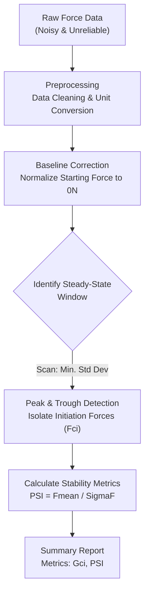

## 1. The Situation: The “False Positive” Trap

**The Gap:** Current industry standards (like ASTM D1876) assume that higher average peel force equals better adhesion.

**The Problem:** I identified that this assumption fails for soft wearables. In stretchable textiles, up to 90% of the "measured force" is actually just the fabric stretching (dissipation), not the glue holding. This creates a **"False Positive Trap"**: selecting adhesives that look strong in the lab but fail functionally on the human body due to stick-slip instability.

## 2. The Action: Rational Engineering

Instead of relying on misleading averages, I applied **first-principles thinking** to re-engineer how we define failure.

- **Logic over Data:** I deconstructed the force profile to distinguish between **true adhesion** (the peaks, representing crack resistance) and **artifacts** (the troughs, representing slip).
- **The Metric:** I introduced the **Peel Stability Index (PSI)**. Unlike raw force, this metric quantifies *consistency*. A high PSI predicts that a sensor will perform reliably without electrical noise, preventing costly device failures downstream.

## 3. The Execution: Automated Python Pipeline

To remove human bias and speed up analysis, I built a custom Python pipeline that operationalizes this physics-based logic.

**Key Contribution:** This automation reduced data processing time by 80% while ensuring that only mechanically stable (Category II) adhesives are selected for the final medical device.

## 4. The Result
- Framework prevents "False Positive" selections
- Ensures mechanically stable adhesives for medical devices
- Validated using T-Peel testing (ASTM D2724 adapted) with custom Python signal analysis

