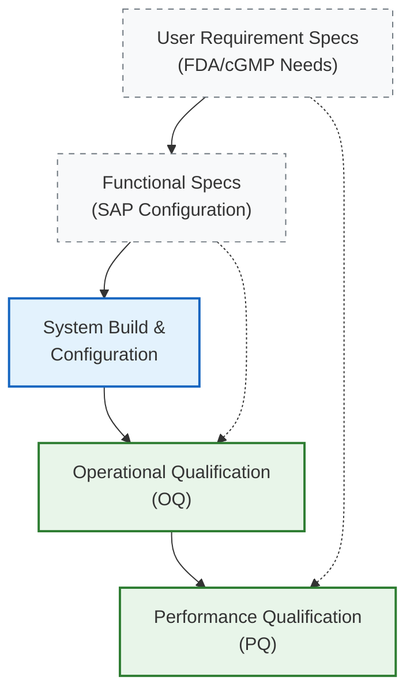

## 1. The Situation: Zero Margin for Error

**The Stakes:** Pharmaceutical manufacturing operates under strict regulatory scrutiny. At **Kreative Organics**, maintaining US FDA audit readiness was critical for business continuity.

**The Gap:** The operational workflow required rigorous validation of the SAP ERP system to meet **cGMP (Current Good Manufacturing Practice)** standards. Any discrepancy in data integrity could lead to audit observations (Form 483) or costly production halts.

## 2. The Task: Validating the Digital Core

As **Technical Project Manager** (promoted from Intern within 6 months), I was tasked with leading the Quality Assurance interface between the technical team and regulatory requirements.

**Primary Objective:** Execute a risk-free transition (cutover) to the new SAP system while ensuring all "Electronic Records" complied with **FDA 21 CFR Part 11** protocols.

## 3. The Action: The V-Model Framework

I implemented a structured **V-Model Validation Framework** to map technical re-qualification requirements directly to testing protocols, serving as the bridge between internal stakeholders and, external SAP partners and consultants.

- **CAPA Management:** Directed Corrective and Preventive Action initiatives by leading Root Cause Analysis (RCA) sessions for operational deviations, Partnered with external SAP Vendors mitgating recurrence.
- **SAP Re-qualification:** Collaborated with external **SAP Consultants** to design the validation strategy, but **personally executed** the OQ/PQ (Operational Performance Qualification) protocols verify the system met FDA standards.
- **Precision Execution:** Coordinated the internal/external technical teams during a **5-hour overnight system cutover re-qualification plan** to safeguard production continuity and data integrity.

**Key Contribution:** By skipping generic installation checks and focusing on Operational & Performance Qualification (OQ/PQ), I ensured the system didn't just "Re-qualified", but actually functioned according to the strict User Requirement Specifications (URS) required by the FDA.

## 4. The Result
- **System Compliance:** Achieved full alignment with cGMP and US FDA regulations through rigorous OQ/PQ execution.
- **SOP Standardization (Process):** Authored and implemented the Standard Operating Procedures that govern human interaction with the system, bridging the gap between technical capabilities and daily operator workflows.
- **Zero Safety Incidents:** Maintained a perfect safety record during the tenure while ensuring the facility remained audit-ready.
