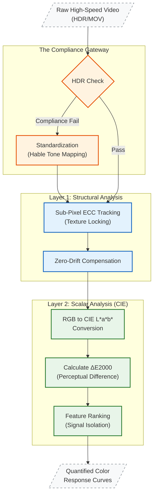

## 1. The Situation: Beyond the Human Eye

**The Context:** Validating mechanochromic materials requires more than just seeing a color change; it requires quantifying it. To prove a material is viable for injury monitoring, we need a precise correlation between mechanical strain and optical response in the **CIE L*a*b*** color space.

**The Gap:** Manual analysis was insufficient. High-speed video data (2000+ frames/test) suffered from lighting variances and mechanical "drift" (clamp slippage), making it impossible to separate true color shifts from environmental noise.

## 2. The Task: A "Ground Truth" Pipeline

I needed to architect a **Computer Vision System** capable of isolating the material's physical response from experimental artifacts.

**Key Requirements:**
- **Input Compliance:** Automatically reject or correct video inputs (HDR/SDR) to ensure lighting standardization.
- **Structural Integrity:** Track the material's texture (yarns) independent of the testing rig to eliminate mechanical noise.
- **Rigorous Colorimetry:** Quantify response using **CIE Lab** scalars, moving beyond basic RGB values to measure Perceptual Color Difference Delta E00/E76.

## 3. The Action: The approach

I developed a modular **Python/OpenCV** architecture that operates on two distinct analytical layers: **Structural (Texture)** and **Scalar (Color Physics)**.

### A. Gateway: Input Compliance & Pre-processing
Before analysis begins, the pipeline acts as a quality gate. It detects High-Dynamic-Range (HDR) profiles and uses an **FFmpeg-based Tone Mapping engine** (Hable method) to enforce a standardized SDR color profile. This ensures that every pixel analyzed represents true material reflectance, not camera auto-exposure artifacts.

### B. Layer 1: Structural Analysis (Texture Tracking)
To solve the "drift" problem, I implemented **ECC (Enhanced Correlation Coefficient)** tracking. Instead of tracking the machine's movement, the code locks onto the *texture* of the rigid clamps with sub-pixel accuracy. This creates a "Virtual Extensometer" that calculates strain based on the actual material deformation, removing fabric slippage noise entirely.

### C. Layer 2: Scalar Analysis (CIE Colorimetry)
Once the region of interest is structurally stabilized, the pipeline performs deep colorimetry. It converts raw pixel data into **CIE Lab** coordinates—separating Lightness L* from Chromaticity a*, b*. This allows us to calculate Delta E00$ (CIEDE2000), providing a mathematically rigorous metric for "Visible Color Change" that matches human perception.

## 4. The Result
- **Scientific Precision:** Successfully decoupled mechanical noise from optical signal, revealing a "Hysteresis Loop" in the color response (fatigue history) that was previously invisible in manual analysis.
- **Throughput:** Reduced data processing time by >90% (from 4 hours/video to 5 minutes), enabling high-volume statistical validation.
- **Standardization:** This pipeline is now the primary validation tool, providing the quantitative CIE metrics required to benchmark new mechanochromic materials against known literature work.
