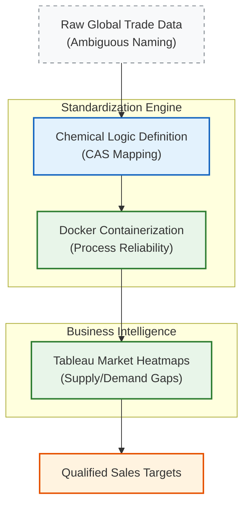

## 1. The Situation: The Nomenclature Barrier

**The Context:** In the pharmaceutical supply chain, speed is critical. At **Kreative Organics**, the Business Development team needed to rapidly identify gaps in the global market for specific chemical intermediates.

**The Gap:** The industry suffers from severe data fragmentation. A single molecule might be listed under a Trade Name, an IUPAC name, or a generic identifier across different global databases.
- **The Chemical Problem:** Mismatched **CAS Numbers** (Chemical Abstracts Service) led to missed market opportunities.
- **The Operational Problem:** Researchers spent 70% of their time manually cross-referencing safety data sheets (SDS) and trade logs rather than analyzing market strategy.

## 2. The Task: Operationalizing Data

I was assigned as the **Technical Project Manager** to lead the **Digital Transformation** of this workflow. My objective was not just "software," but **Process Engineering**: creating a robust, standardized pipeline that could translate ambiguous market data into actionable chemical intelligence.

**Key Objectives:**
- **Standardization:** Define a logic to resolve chemical synonym conflicts and establish a "Single Source of Truth."
- **Reliability:** Ensure the tool was robust enough for non-technical staff to run independently.
- **Market Speed:** Compress the timeline from "Data Gathering" to "Sales Action."

## 3. The Action: Engineering the Process

I operated as the **Technical Lead**, bridging the gap between chemical domain knowledge and technical execution.

### A. Defining the "Chemical Logic" (Strategy)
I engineered the standardization algorithm. Unlike a generic developer, I understood the nuances of chemical naming conventions. I defined the rulesets for mapping inconsistent trade names to verified **CAS Names**, ensuring scientific accuracy in the output.

### B. Containerizing the Workflow (Docker)
To ensure operational continuity, I packaged the solution using **Docker**. This wasn't just about code; it was about **Process Reliability**. By containerizing the environment, I ensured that the standardization engine ran identically on every machine, immune to local configuration errors—critical for a regulated industrial environment.

### C. Visualizing Market Gaps (Tableau)
I developed **Strategic Dashboards** in Tableau that mapped global trade volume against our internal inventory. This transformed raw rows of data into stratergic insights, allowing the sales team to navigate and spot the under-served regions for specific chemical classes.

## 4. The Result
- Operational Efficiency: Slashed market research time by 70%, effectively automating the "grunt work" of data collection.
- Data Integrity: Achieved a 90% accuracy uplift in chemical identification, virtually eliminating errors caused by synonym confusion.
